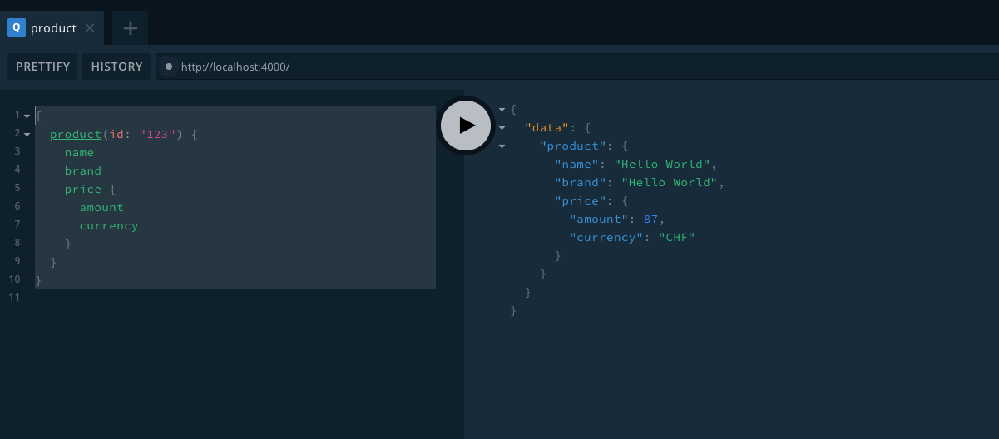

<span style="font-size: 11px;">Photo by Jakub Jacobsky on Unsplash</span>

## Why serverless

What are the advantages of a serverless api?

1. Pay as you go: We have zero initial costs and pay only for what we actually use. So while we develop our app, we have close to zero costs, and depending on how it develops it will scale automatically when traffic increases.
2. Infinite Scaling: We don't have to deal with infrastructure or servers, so when our requests suddenly goes from 0 to 1000s of requests per second, it won't be a problem because the serverless api will scale automatically for us. (AWS handles that in the background)
3. Faster development: We don't have to deal with managing , installing and configuring servers, or with deployment processes, so we can just focus on the business logic and building our app.

Serverless might not be the answer for all our problems but an GraphQL server seems like a great use case, so let's dive right in.

## Architecture

There are multiple providers for serverless functions, but the biggest and most famous one is [AWS Lambda](https://aws.amazon.com/lambda/). This is the one we will be using here.
Other famous examples providers are [Azure Functions](https://azure.microsoft.com/en-us/services/functions/), [Google Cloud Functions](https://cloud.google.com/functions/) and [Cloudflare Workers](https://www.cloudflare.com/products/cloudflare-workers/).

To make our lives easier we are going to leverage [the serverless framework](https://serverless.com/) for automating our deploys, so we can just define our deployment configuration in a `serverless.yml` file and don't need to worry about manual deployment.
Therefore we should install the serverless cli globally using `npm install -g serverless`. This installs a global cli tool which can be invoked by `serverless` or `sls`.

As a GraphQL server we are using [Apollo](https://www.apollographql.com/), which is also one of the most famous graqhql clients and servers. Apollo Client now fully [supports](https://www.apollographql.com/docs/react/api/react-hooks/) [React Hooks](https://reactjs.org/docs/hooks-intro.html) which is one of the reasons I love using it.
The server-side implementation with Apollo is also very straightforward and they offer an [AWS Lambda compatible package](https://www.apollographql.com/docs/apollo-server/deployment/lambda/), `apollo-server-lambda`, which we are going to use in this tutorial.

## The Apollo Server

GraphQL comes with a default UI, the grahiQL client, which gives us the possibility to inspect a schema and to request data from an API. Apollo Server also mocks our schema by default, so the initial setup of our GraphQL server is very compact - there is not much code needed at all to get started.

Assuming we are in a fresh project folder.

```bash
mkdir graphql-serverless-example
cd graphql-serverless-example
npm init -y\
```

First, let's do an

```bash
npm install apollo-server apollo-server-lambda graphql
```

I install both apollo-server and apollo-server-lambda here, because I want to develop most of the time locally and deploy to lambda every once in a while. Both the local and the lambda versions are going to use the same _schema_, so let's create a file `grapqhl/schema.js` from which we can then export our schema.

```js
// schema.js
const { gql } = require("apollo-server-lambda");

const typeDefs = gql`
  type Image {
    source: String # Url scalar
    description: String
    thumbnailSource(width: Int, height: Int): String # Url scalar
  }

  enum Currency {
    EUR
    CHF
    USD
  }

  type Price {
    amount: Int
    currency: Currency
  }

  type Product @cacheControl(maxAge: 300) {
    id: ID!
    name: String
    description: String
    image: Image
    brand: String
    price: Price
  }

  type Query {
    product(id: ID!): Product
  }
`;

const resolvers = {};

const mocks = {};

module.exports = {
  typeDefs,
  resolvers,
  mocks,
  mockEntireSchema: true
};
```

This defines a fairly simple schema for `Product` which might resemble some form of e-commerce article data.

For quicker local development, we create a file `local.js`, where we import ApolloServer and our schema and fire up a local instance.

```js
// local.js
const { ApolloServer } = require("apollo-server");

const { typeDefs, resolvers, mocks } = require("./graphql/schema");

const server = new ApolloServer({
  typeDefs,
  resolvers,
  mocks,
  mockEntireSchema: false
});

server.listen().then(({ url }) => {
  console.log(`🚀 Server ready at ${url}`);
});
```

For local development we will `npm install --save-dev nodemon` and add a npm script to our `package.json`:

```
"scripts": {
    "dev": "nodemon local.js"
  }
```

This will automatically restart the apollo-server in `local.js` whenever we change any files.

Fot the serverless function we create a file `lambda.js` with the following content:

```js
// lambda.js
const { ApolloServer } = require("apollo-server-lambda");

const { typeDefs, resolvers, mocks } = require("./graphql/schema");

const server = new ApolloServer({
  typeDefs,
  resolvers,
  mocks,
  mockEntireSchema: false,
  context: ({ event, context }) => ({
    headers: event.headers,
    functionName: context.functionName,
    event,
    context
  })
});

module.exports = {
  server
};
```

This one is very similar to the `local.js` development server, except that we import `ApolloServer` from the `apollo-server-lambda` package now and we add some extra context object to the constructor (more on that later). We just export the the ApolloServer instance here again.

Now create another file, `index.js`, where we import said server.

```js
// index.js
const { ApolloServer } = require("apollo-server-lambda");

const schema = require("./schema");

const server = new ApolloServer(schema);

exports.graphqlHandler = server.createHandler({
  cors: {
    origin: "*",
    credentials: false
  },
  endpointURL: "/graphql"
});
```

Now create the `serverless.yml` file.

```yaml
org: tmaximini
app: apollo-lambda-app
service: apollo-lambda
provider:
  name: aws
  runtime: nodejs10.x
  region: eu-central-1
iamRoleStatements:
  Effect: "Allow"
  Action:
    - "dynamodb:GetItem"
    - "dynamodb:PutItem"
    - "dynamodb:Scan"
  Resource: "*"
functions:
  graphql:
    # this is formatted as <FILENAME>.<HANDLER>
    handler: index.graphqlHandler
    events:
      - http:
          path: graphql
          method: get
          cors: true
          integration: lambda-proxy
```

What is going on here? Serverless framework is configured using a [yaml file](https://serverless.com/framework/docs/providers/aws/guide/serverless.yml/) - the most important point here are:

- we want to use AWS as a provider (Lambda) with a nodejs runtime of version 10.x
- we want to run it in `eu-central-01` region (You might want to change that depending on your location)
- we need some [IAM policies](https://serverless.com/framework/docs/providers/aws/guide/iam/)
- most importantly, we we tell serverless which functions should correspond to which endpoints: Here we have a function (we call it graphql) that uses the handler `index.graphqlHandler`, this means _go check index.js for a function called graphqlHandler_ and then use this for the following event definitions, in our case a simple `http get` with a path of `/graphql`.

## The first test

Let's run `npm run dev` and the local development server should start up:

```bash
🚀 Server ready at http://localhost:4000/
```

Now visit http://localhost:4000 and confirm everything works, you should see a GraphQL Playground.


<span style="font-size: 11px;">Our GraphQL Playground at localhost:4000</span>

As ApolloServer mocks everything by default, you can now run your first test query against the server:

```graphql
{
  product(id: "123") {
    name
    brand
    price {
      amount
      currency
    }
  }
}
```
