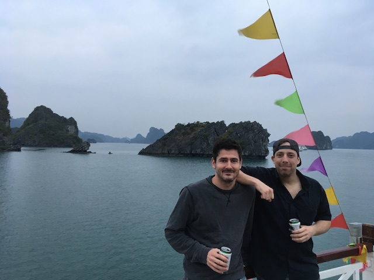
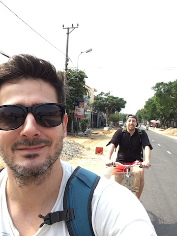
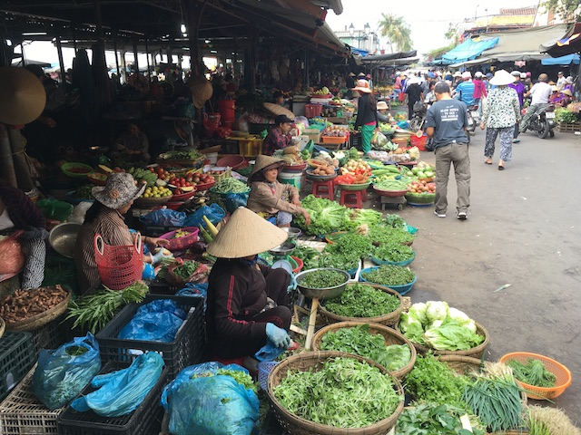
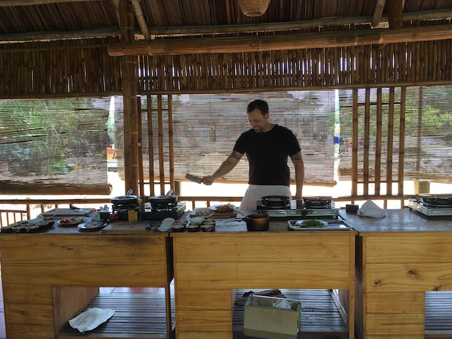
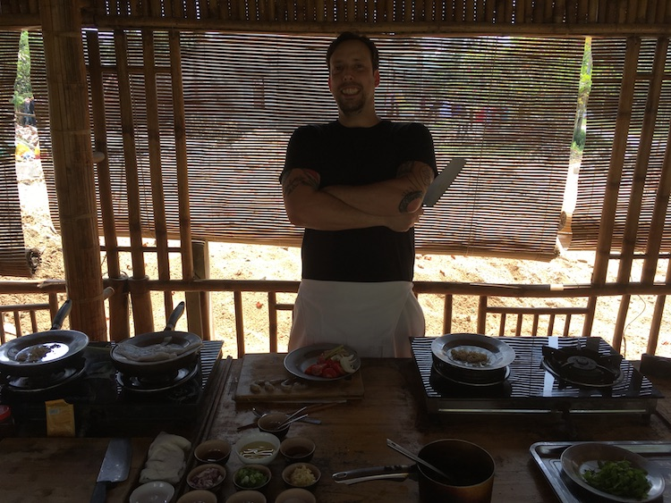
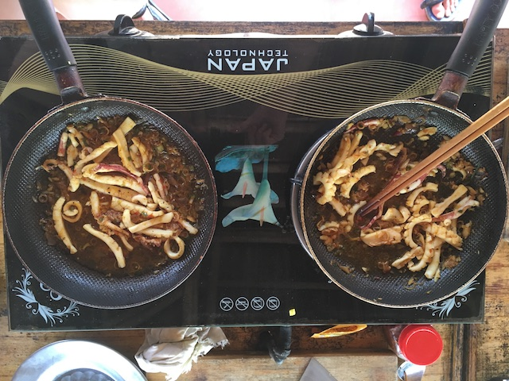
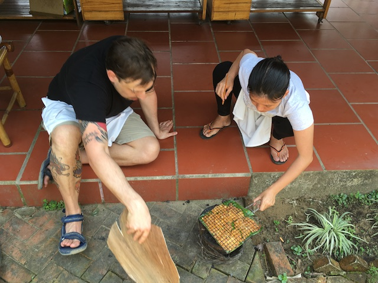
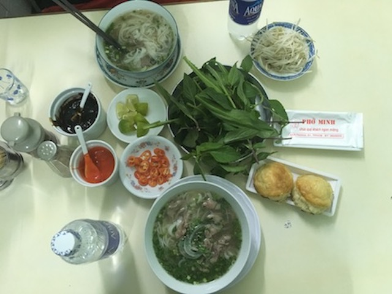
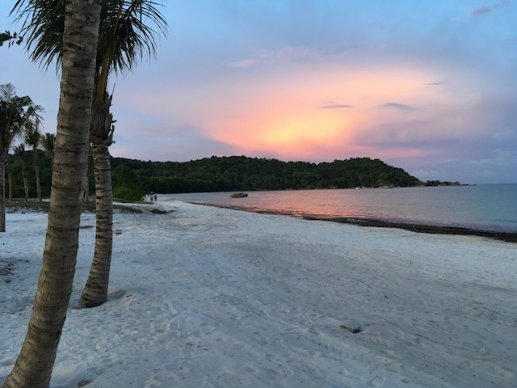

In March 2017 I started my first big trvel adventure. After giving up my flat in Berlin me and my good friend Dominik were heading to Asia for a couple of months. I saved up big time for the trip and as I (nearly) didn't have any more fix costs in Germany I was convinced this trip was going to last a while. It was actually the first time for me to leave Europe except from a 10 day trip to New York in 2012.

So we packed our backpacks and flew into Hanoi, Vietnam. On our way there we had to change in Moscow, Russia and nearly missed our connection flight because we were waiting in the wrong queue for an hour! But we made it and got our first culture shock quickly in Hanoi - the scooter traffic, the narrow streets, the smell, the people, the colors. Everything was so different from Germany or Europe in general. We felt great!

[[photos]]
| 
| 
| 
| 
| 
| 
| 
| 
| 
