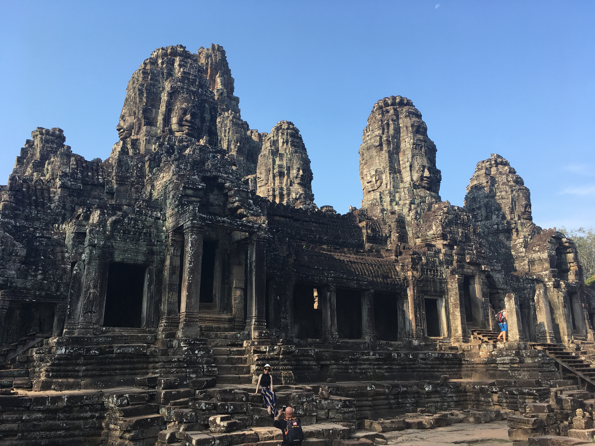
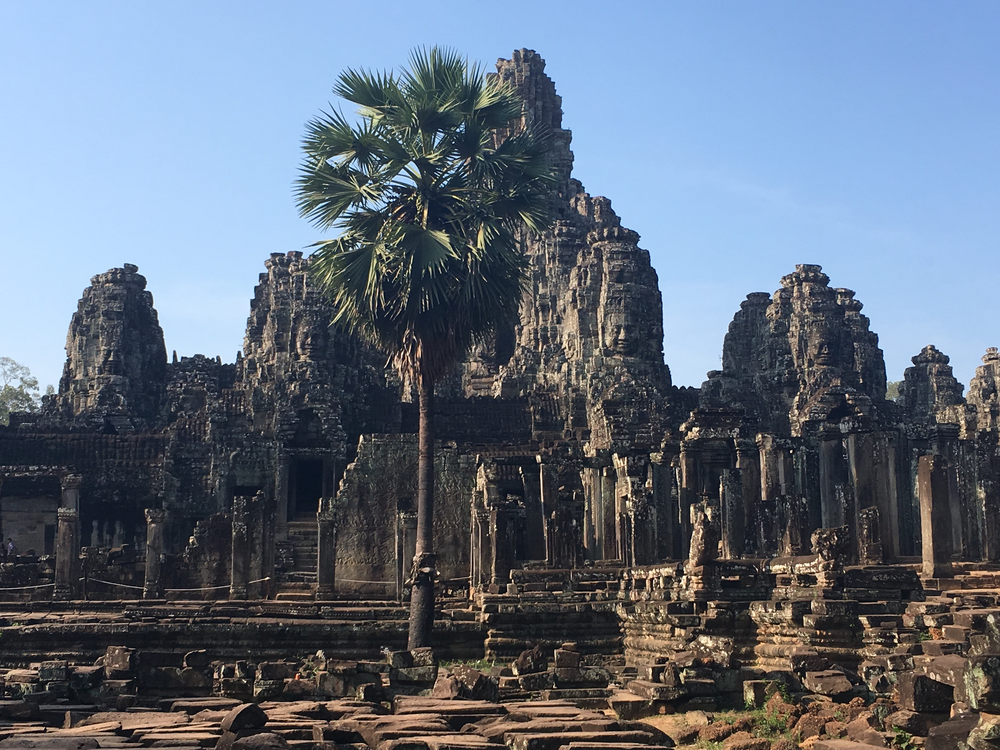
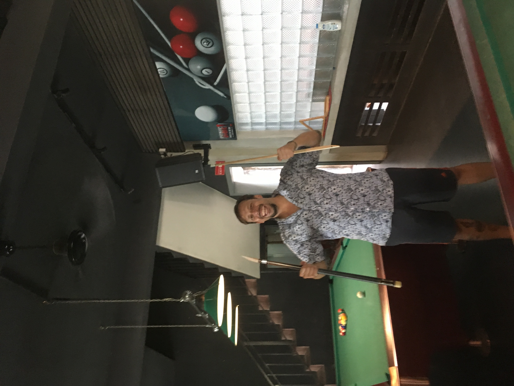
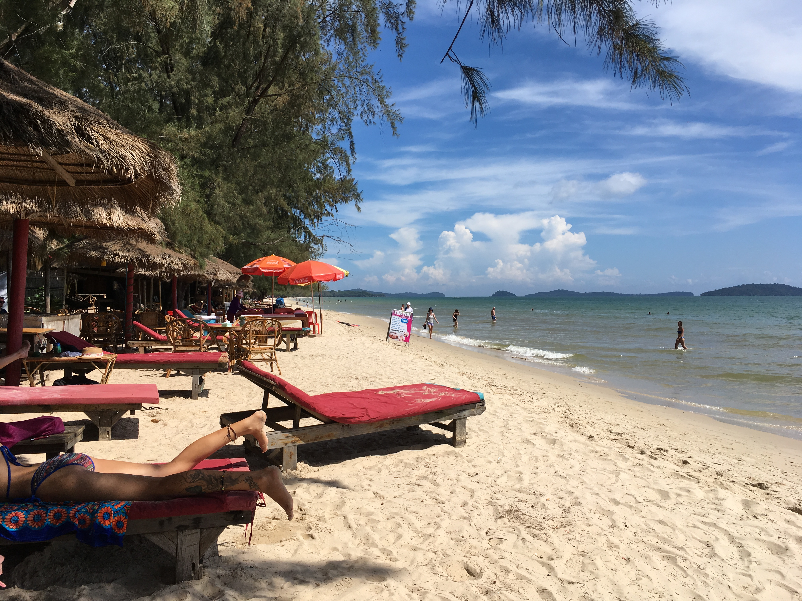
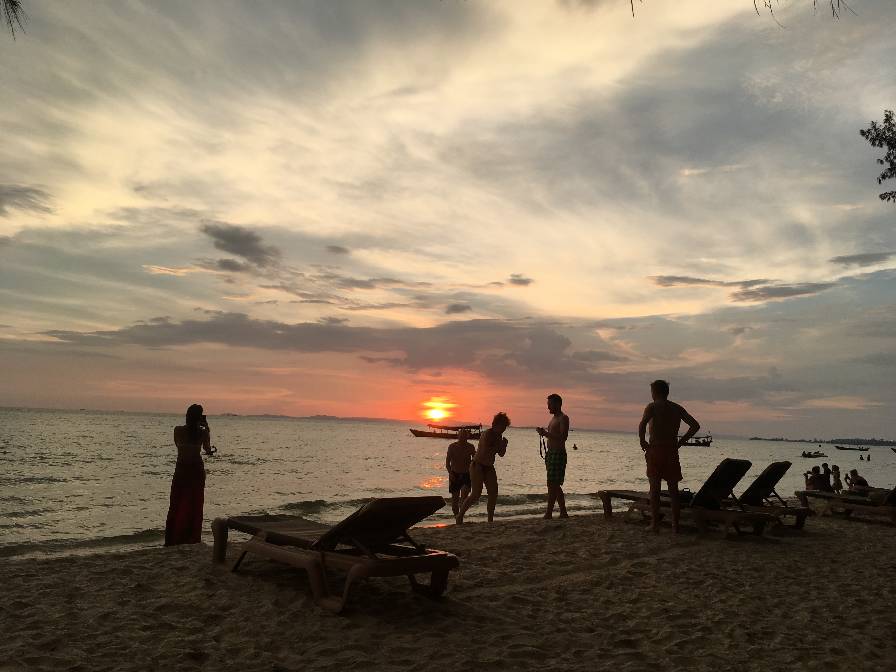
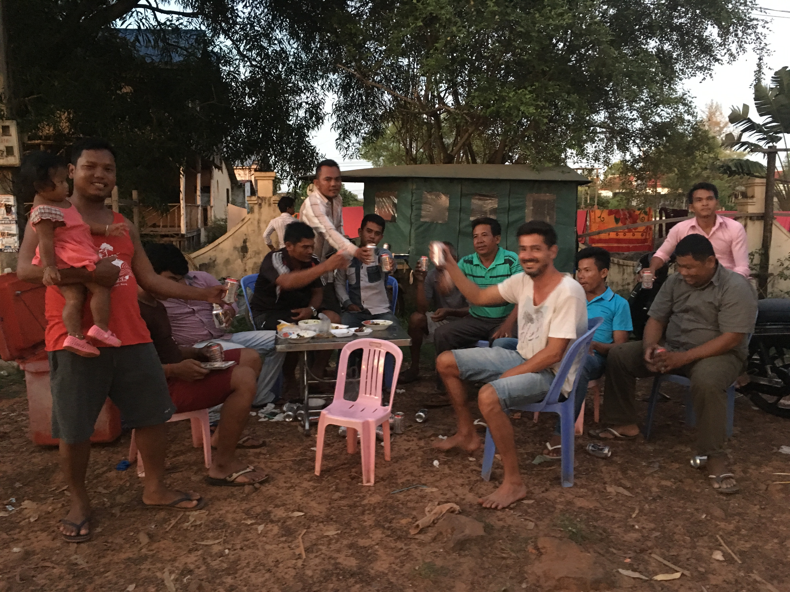

The next stop after Vietnam was the Kingdom of Cambodia! The trip there was quite spectacular, as it involved a boat trip where we were freezing (the A/C was on maximum and friggin cold), several bus trips and a lot of patience. The landscape was beautiful though and we met some interesting characters along the way.

This was one of the highlights of our first trip. Otres is a small village and a group of 2 beaches close to Sihanoukville in the south of Cambodia. It is a backpacker's paradise with lots of great hostels, restaurants, parties, cafe's and just has a very certain hippie vibe to it that makes it so relaxing. We spent there nearly two weeks and to be honest I could have stayed even longer. From there you can also visit the beautiful islands of Koh Rong and Koh Ta Kiev.

After that we went to Siem Reap, a must stop for anyone visiting Cambodia as it is the home of the world famous temples of Ankor Wat and Ankor Tom.

[[photos]]
| 
| 
| 
| 
| 
| 
| 
| 
| 
| 
| 
| 
