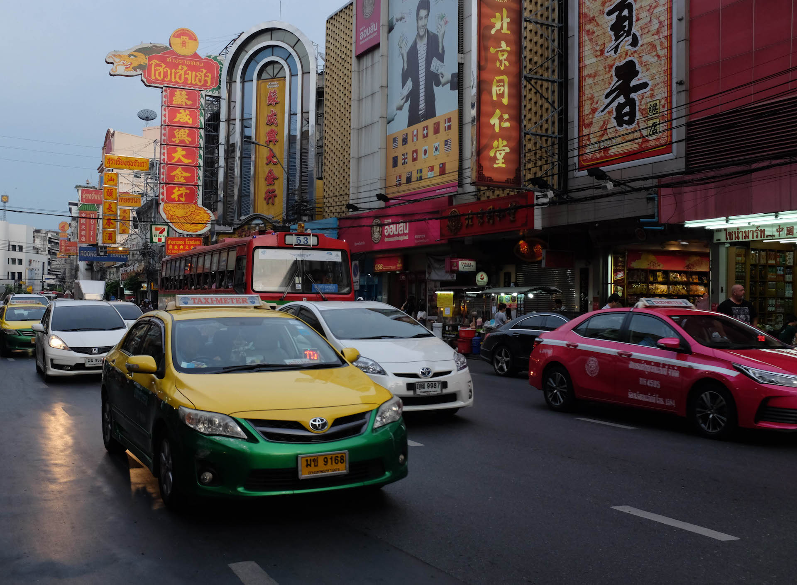
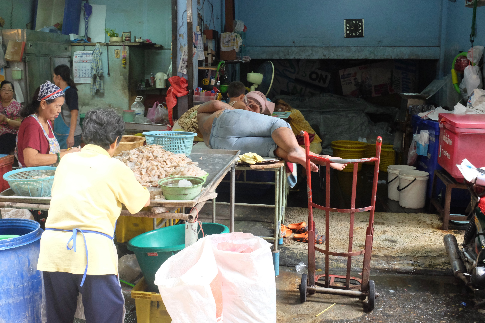
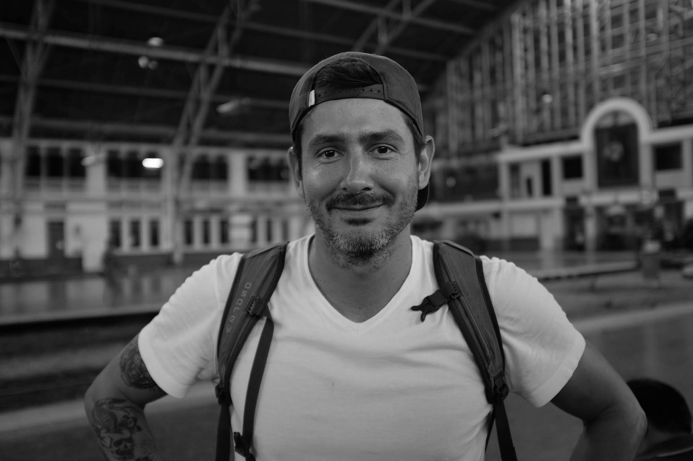
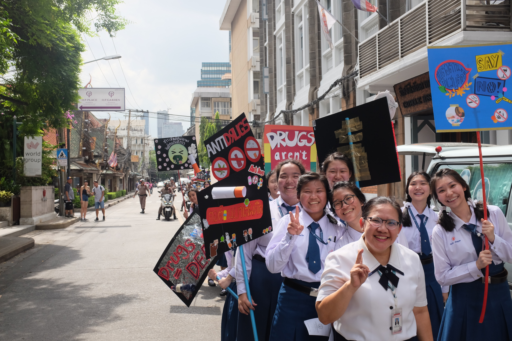
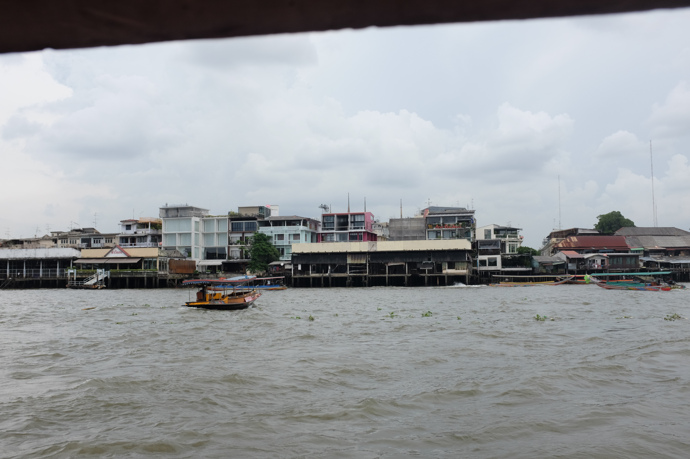
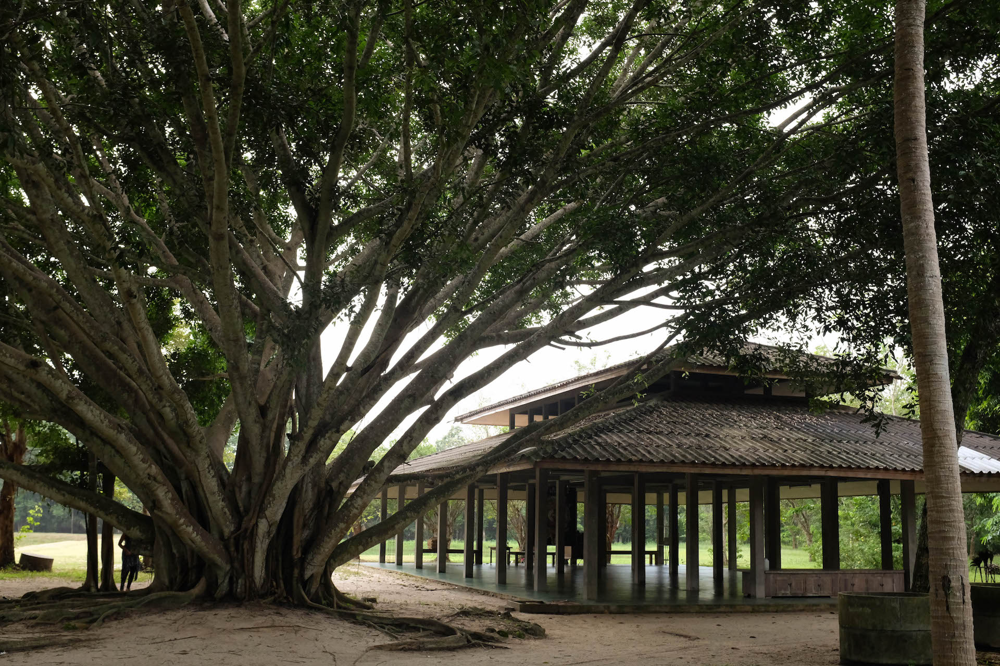

### English Camp Phatthalung

So thi year's travel would start in Thailand. I met a guy on Couchsurfing and he recruited me straight away as an English Teacher for a 3 day camp in Phatthalung. Phatthalung is in souther Thailand and he lives in Chiang Mai in the north, so in addition to the 3 days camp we would have 2 days road trip before and after the camp. They picked me in Bangkok just a couple of hours after I arrived there.

[[img-row-3]]
| 
| 
| 

### Bangkok

When I was the first in Thailand in 2017 I skipped Bangkok and went straight to Chiang Mai, so this time I _had_ to take a look at this megacity. I let them drop my off close to Bangkok to check it out with Romeo, one of the other teachers. I wasn't disappointed! It is what I imagined and a million things more. Quite a crazy city. The traffic is crazy, the smells, the images.

[[photos]]
| 
| 
| 
| 
| 
| 
| 
| 
| 
| 
| 
| 
| 
| 

### Suan Mokh: 10 day silent meditation retreat

Something I wanted to do for quite a while is participate in a Vipassana meditation retreat. I heard about this one in Surat Thani when I was in Koh Pangan last year and this specific one always starts at the 1st of each month. You just have to show up, first come first serve, and after busy Bangkok I decided now it would be the right time to do it. It was truely a great experience for me, as somehow who always has a lot of chatter going on inside my head. No phones, no internet, no talking, no alcohol, nothing to do except meditation in the nature for 10 days. I felt very calm afterwards I tell you. It is somethiing I would recommend everybody doind on a regular basis, it feels like recharging the mind. Here you find more information about the retreat: [Suan Mokkh International Dharma Heritage](http://www.suanmokkh-idh.org/).

[[img-row-2]]
| 
| 

[[img-row-2]]
| 
| 

### English Camp Chiang Mai

After I finished the retreat I found out that just on the next day there would be another English Camp in Chiang Mai where I wanted to go anyway. So I booked a last minute flight from Surat Thani to Chiang Mai the same day, got picked up at the airport, spend one night in a comfy hostel after 12 nights on a concrete bed and went straight back to "work" the next day.
The kids were so awesome though that it did not really feel like work at all :)

[[photos]]
| 
| 
| 
| 
| 
| 
| 
| 
