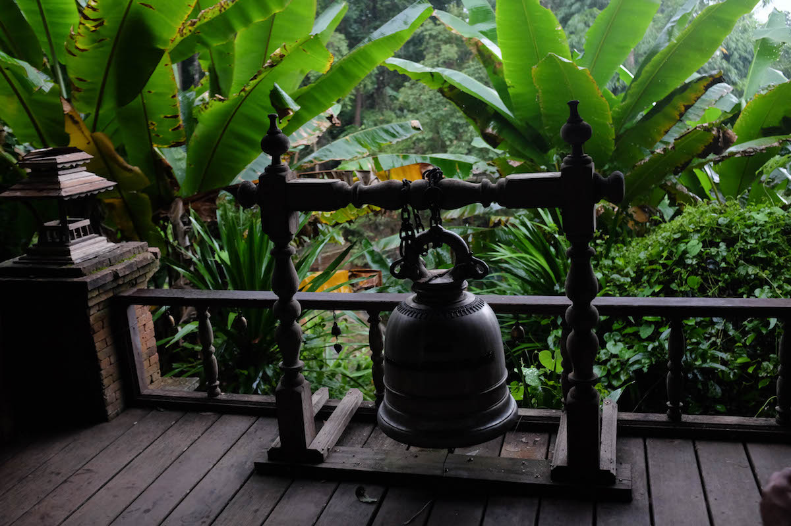
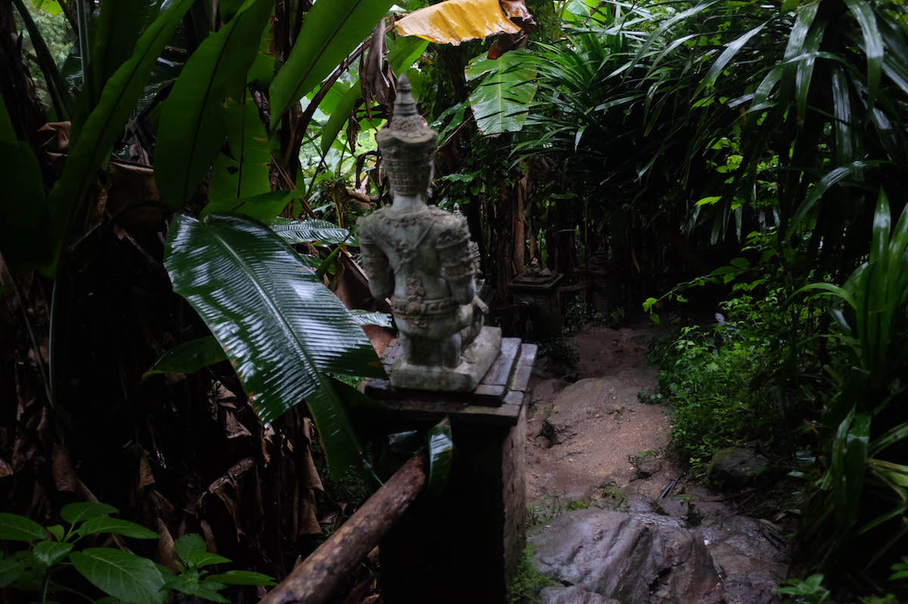
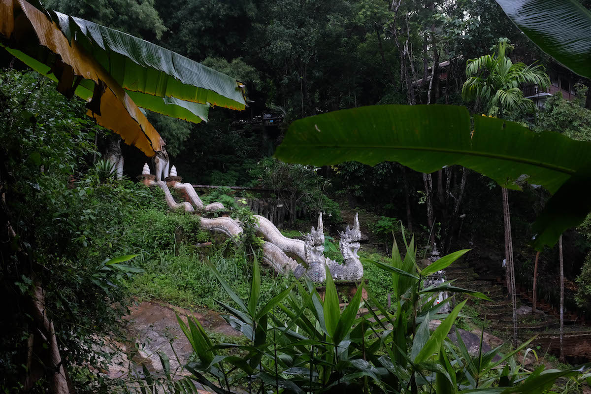
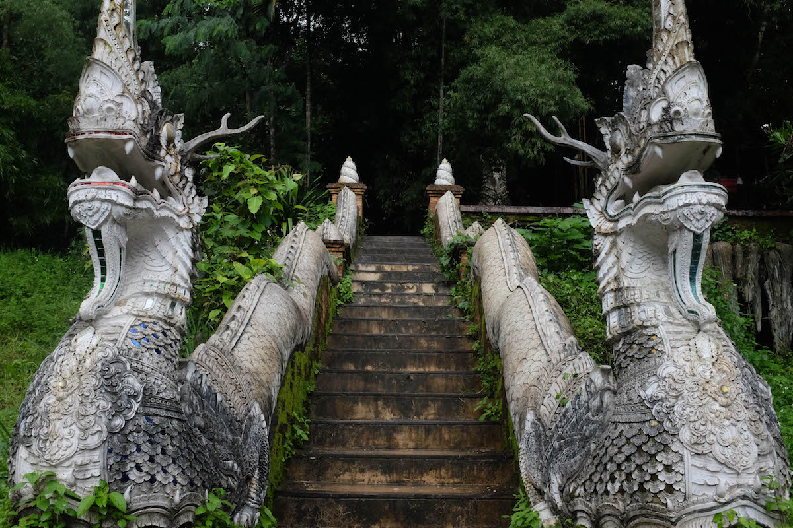
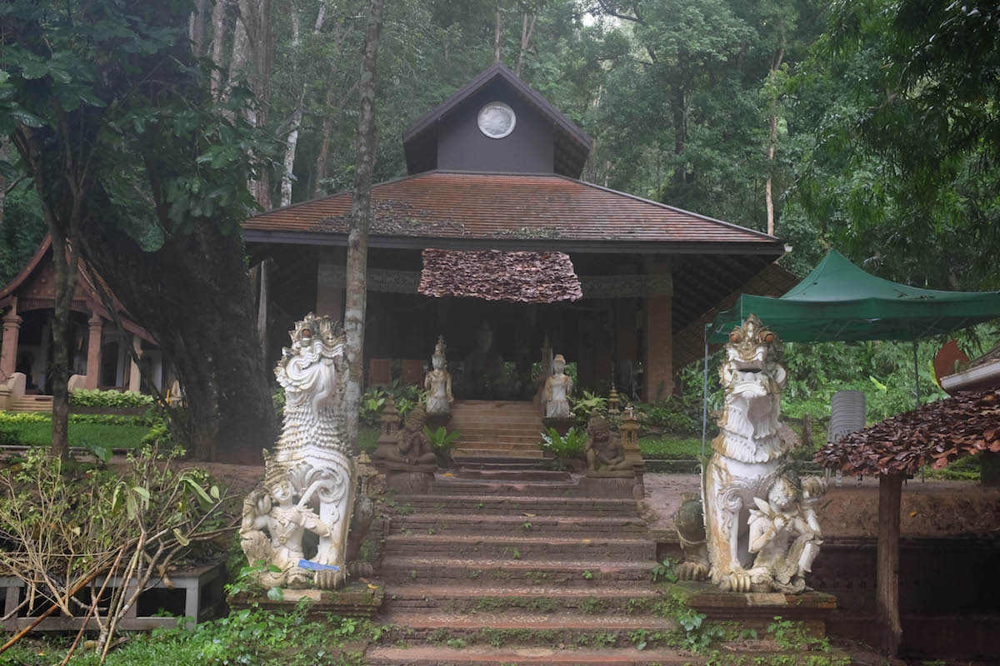
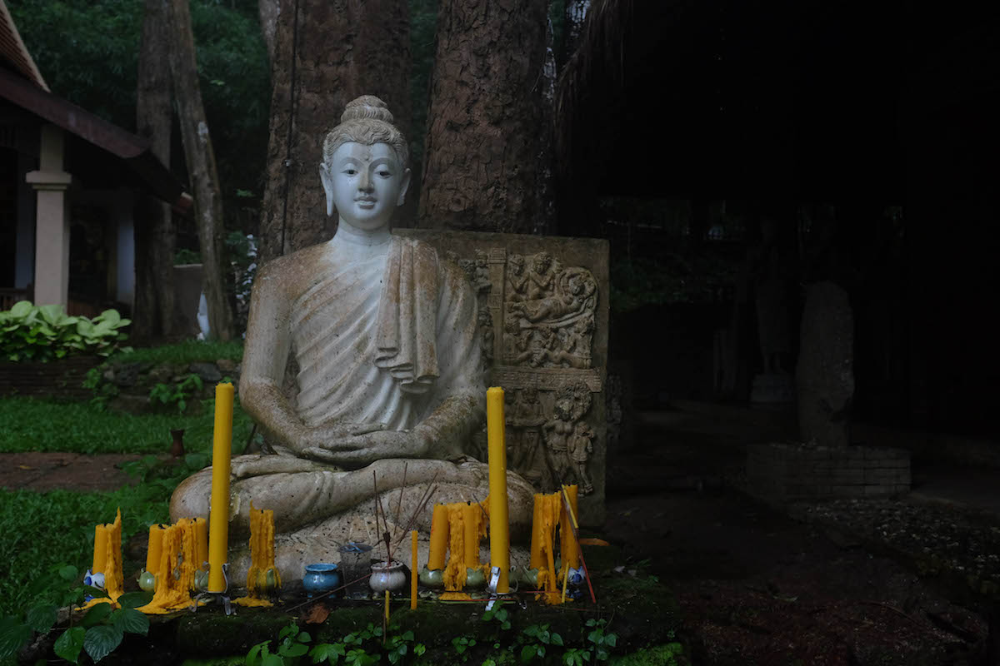

My second time around in Thailand I decided I want some time ro unwind and process the things that happened in the last months and years perhaps. Luckily I found a nice apartment for around 150€ / month. So I spend one month developing a mostly healthy routine of workout, food, work, meditation and sleep. I did not visit as much of the surroundings as I planned to but still had some time to visit temples, go trekking and do some sightseeing.

[[photos]]
| 
| 
| 
| 
| 
| 
| 
| 
| 
| 
| 
| 
| 
| 
| 
| 
| 
| 
| 
