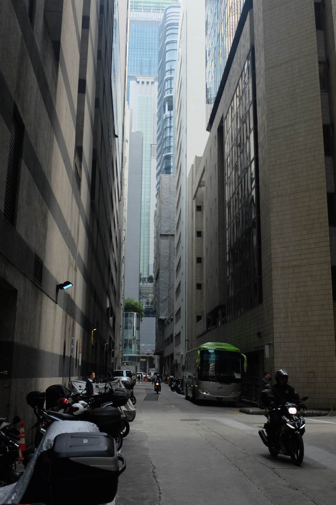

## Singapore

After spending my first month in Thailand, I decided that instead of extending my Visa for a month I would visit my friend in Singapore and do what they call a Visa-run (leave the country for a couple of days and come back). So I booked my ticket to Singapore. After explaining my plan to my Thai friends they said I must be a secret millionaire - because Singapore is the most expensive city in the world! I had no idea :) Luckily I could stay in Julia's place for the time being and not only this, it was also a very luxurious skyscraper apartment with pool terrace and a billiard room! What a blast. While she was working I went exploring the city with my camera. What I liked about it is the cultural and ethnic variety. I went to the Arab quarter, little India and Chinatown all walking on the same day. It is also very clean for such a huge city, probably the cleanest you will find on this planet. The skylines are beautiful and they have great food everywhere. The price for a pint of beer was around 10-15 SGP $, which equals 7-10 euro roughly.

[[photos]]
| 
| 
| 
| 
| 
| 
| 
| 
| 
| 
| 
| 
| 
| 
| 
| 

[[img-row-2]]
| 
| 
